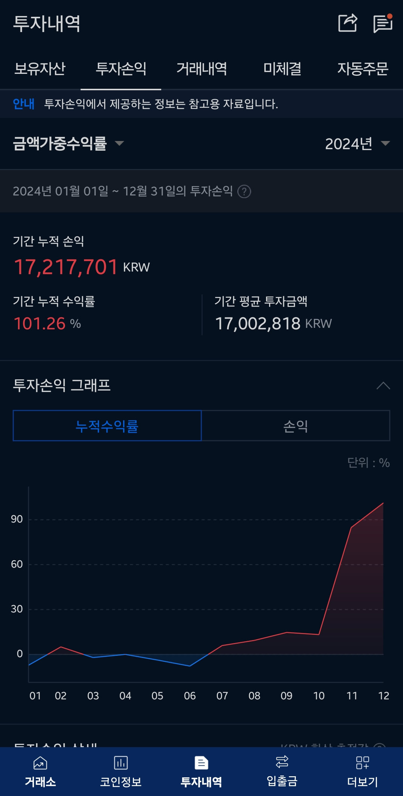
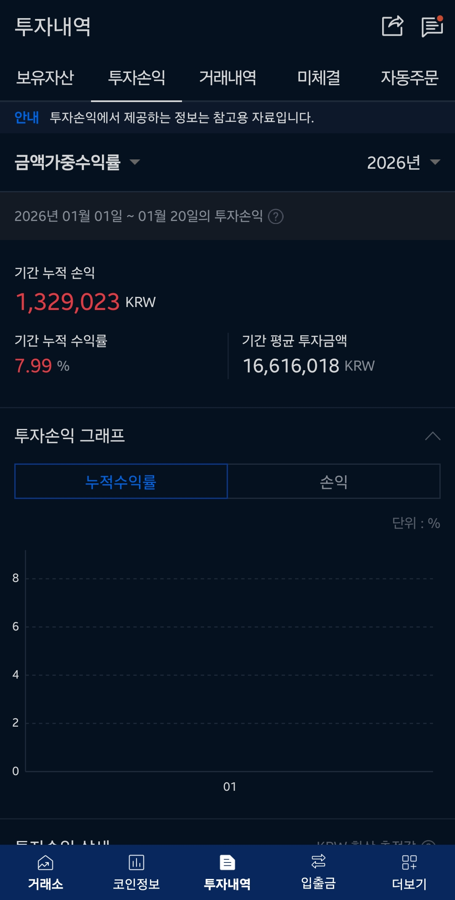

# Crypto Quant System

Upbit 거래소 기반 암호화폐 퀀트 트레이딩 플랫폼.
백테스팅, 전략 개발, 포트폴리오 최적화, 라이브 트레이딩 모니터링을 하나의 시스템으로 통합.

[](https://www.python.org/downloads/)
[]()
[]()
[]()
[]()

## Live Trading Performance (Upbit)

<table>
  <tr>
    <td align="center"><b>2024</b><br>Return: 101.26%</td>
    <td align="center"><b>2025</b><br>Return: 19.28%</td>
    <td align="center"><b>2026 YTD</b><br>Return: 7.99%</td>
  </tr>
  <tr>
    <td></td>
    <td></td>
    <td></td>
  </tr>
</table>

## Backtest Results

<table>
  <tr>
    <td align="center">Equity Curve</td>
    <td align="center">Yearly Returns</td>
  </tr>
  <tr>
    <td></td>
    <td></td>
  </tr>
</table>

---

## Ecosystem

4개 repo가 GCS를 통해 느슨하게 결합된 구조. 코드 의존성 없이 데이터/모델 아티팩트로만 통신.

```
                            GCS (Cloud Storage)
                     ┌────────────┴────────────┐
                     │  logs/   models/  data/  │
                     └──┬──────────┬──────────┬─┘
                        │          │          │
  ┌─────────────────────┼──────────┼──────────┼────────────────────┐
  │  crypto-quant-system │          │          │  (this repo)       │
  │  ━━━━━━━━━━━━━━━━━━━━━━━━━━━━━━━━━━━━━━━━━━━━━━━━━━━━━━━━━━━  │
  │  Backtesting Engine  │  읽기 ◄─┤  읽기 ◄──┤  Dashboard         │
  │  Strategy Library    │          │          │  Bot Monitor       │
  │  Data Pipeline       │          │          │  Optimization      │
  │  Risk Management     │          │          │  WFA / Monte Carlo │
  └──────────────────────┼──────────┼──────────┼───────────────────┘
                         │          │          │
  ┌──────────────────────┤          │          │
  │  crypto-bot          │          │          │
  │  ━━━━━━━━━━━━━━━━━━  │          │          │
  │  Live Trading Bot    │          │          │
  │  Upbit 실매매 (VBO)   │  쓰기 ──►│          │
  │  Docker / GCP e2     │          │          │
  └──────────────────────┘          │          │
                                    │          │
  ┌─────────────────────────────────┤          │
  │  crypto-regime-classifier-ml    │          │
  │  ━━━━━━━━━━━━━━━━━━━━━━━━━━━━  │          │
  │  ML Regime Classifier           │          │
  │  XGBoost / LSTM / Transformer   │  쓰기 ──►│
  │  Walk-Forward Validation        │          │
  └─────────────────────────────────┘          │
                                               │
  ┌────────────────────────────────────────────┘
  │  bt (archived)
  │  ━━━━━━━━━━━━━
  │  핵심 로직 CQS에 흡수 완료. 아카이브 상태.
  └────────────────────────────────────────────
```

| Repo | 역할 | LOC | 상태 |
|------|------|-----|------|
| **crypto-quant-system** | 백테스트, 대시보드, 데이터 파이프라인 | ~7,500 | Active |
| **crypto-bot** | Upbit 실매매 봇 (VBO) | ~930 | Active (독립 배포) |
| **crypto-regime-classifier-ml** | ML 시장 국면 분류기 | ~6,100 | Active (모델 학습) |
| **bt** | 이전 백테스트 프레임워크 | ~17K | Archived (CQS에 흡수) |

### 왜 분리하는가?

- **crypto-bot**: 930줄 경량 봇. Docker로 GCP e2-micro(무료)에 독립 배포. 의존성 최소화(pyupbit+pandas). 흡수하면 배포 복잡도 증가.
- **crypto-regime-classifier-ml**: PyTorch, XGBoost, TA-Lib 등 무거운 ML 의존성. 학습은 비정기적. CQS는 추론만 수행(.joblib 로드). 흡수하면 CQS 설치 사이즈 ~2GB 증가.
- **bt**: 핵심 410줄 CQS에 포팅 완료. 나머지 ~16K줄은 REST API, 플러그인 시스템 등 불필요한 인프라. 아카이브.

---

## Features

### Backtesting Engine

듀얼 엔진 아키텍처:

| 엔진 | 용도 | 특징 |
|------|------|------|
| **EventDrivenBacktestEngine** | 전략 개발, 정확한 검증 | 일별 순차 처리, 상세 거래 로그 |
| **VectorizedBacktestEngine** | 파라미터 최적화 | NumPy 배치 처리, 100x 빠름 |

```python
from src.backtester.engine import EventDrivenBacktestEngine, VectorizedBacktestEngine
from src.backtester.models import BacktestConfig
from src.strategies.volatility_breakout import VBOPortfolio

config = BacktestConfig(initial_capital=10_000_000, fee_rate=0.0005, slippage_rate=0.001)
engine = VectorizedBacktestEngine(config)
result = engine.run(VBOPortfolio(btc_data=btc_df), data_files)

print(f"CAGR: {result.cagr:.2f}%, MDD: {result.max_drawdown:.2f}%, Sharpe: {result.sharpe_ratio:.2f}")
```

### Strategy Library

조합 가능한 조건(Condition) 패턴 기반 전략:

| 전략 | 설명 | 변형 |
|------|------|------|
| **VBO** | 변동성 돌파 (open + prev_range * K) | Vanilla, Strict, Minimal, Portfolio, Lite, V1, Regime |
| **VBOV1** | V1 전략: 고정 K=0.5, 시가 매도, BTC MA20 필터 | 단일 |
| **VBORegime** | VBO + ML 국면 분류기 (bull market만 진입) | 단일 |
| **ORB** | 시가 범위 돌파 | 단일 |
| **Momentum** | 추세 추종 | 단일 |
| **Mean Reversion** | 평균 회귀 | 단일 |

전략 자동 등록: `Strategy` 서브클래스 작성시 대시보드에 자동 노출.

### Data Pipeline

```bash
# Upbit에서 OHLCV 다운로드
python scripts/fetch_data.py --symbols BTC,ETH,XRP --interval day

# 기존 데이터 업데이트
python scripts/fetch_data.py --update

# 복수 인터벌
python scripts/fetch_data.py --symbols BTC --interval day,minute240,minute30
```

### Web Dashboard (Streamlit)

| 페이지 | 기능 |
|--------|------|
| **Data Collection** | Upbit 데이터 수집, 상태 확인 |
| **Backtest** | 전략 선택, 파라미터 설정, 30+ 메트릭, 차트 |
| **Optimization** | Grid/Random 파라미터 최적화 |
| **Analysis** | Walk-Forward, Monte Carlo, Bootstrap |
| **Bot Monitor** | GCS 로그 기반 실시간 모니터링 |

```bash
streamlit run src/web/app.py
```

### Risk Management

| 기능 | 구현 |
|------|------|
| Position Sizing | Equal, Kelly, Fractional Kelly |
| Portfolio Optimization | MVO, HRP, Risk Parity |
| Risk Metrics | VaR, CVaR, Volatility, Drawdown |
| Advanced Orders | Stop Loss, Take Profit, Trailing Stop |

### ML Regime Integration

CQS는 `crypto-regime-classifier-ml`에서 학습된 XGBoost 모델을 로드하여 시장 국면 분류:

```python
from src.strategies.volatility_breakout import VBORegime

# BTC 국면이 BULL_TREND일 때만 진입
strategy = VBORegime(btc_data=btc_df)
result = engine.run(strategy, data_files)
```

---

## Quick Start

### Installation

```bash
git clone <repository-url>
cd crypto-quant-system

# uv (recommended)
uv sync --all-extras

# pip
pip install -e ".[dev]"
```

### Run

```bash
# Dashboard
streamlit run src/web/app.py

# Backtest (CLI)
python scripts/backtest/run_backtest.py --mode report

# Tests
python -m pytest tests/ -x -q

# Quality gates
python -m ruff check src/ tests/
python -m mypy src/ --strict
```

---

## Project Structure

```
crypto-quant-system/
├── src/
│   ├── backtester/                 # Backtest engines
│   │   ├── engine/                 # Vectorized + Event-driven
│   │   │   ├── vectorized.py       # NumPy 배치 엔진
│   │   │   ├── event_driven.py     # 일별 순차 엔진
│   │   │   ├── signal_processor.py # 진입/퇴출 가격 (exit_price_base 지원)
│   │   │   ├── trade_simulator.py  # 벡터화 거래 시뮬레이션
│   │   │   ├── event_exec.py       # 이벤트 기반 거래 실행
│   │   │   └── trade_costs.py      # 수수료/슬리피지 계산
│   │   ├── analysis/               # CPCV, Bootstrap, Monte Carlo
│   │   ├── wfa/                    # Walk-Forward Analysis
│   │   ├── models.py               # BacktestConfig, BacktestResult, Trade
│   │   ├── metrics.py              # 30+ 성과 메트릭
│   │   └── optimization.py         # Grid/Random 파라미터 최적화
│   │
│   ├── strategies/                 # Trading strategies
│   │   ├── base.py                 # Strategy ABC (Composable Conditions)
│   │   ├── volatility_breakout/    # VBO 전략 패밀리
│   │   │   ├── vbo.py              # Vanilla, Strict, Minimal
│   │   │   ├── vbo_portfolio.py    # Portfolio, Lite, SingleCoin
│   │   │   ├── vbo_v1.py           # V1 (고정K, 시가매도)
│   │   │   ├── vbo_regime.py       # ML 국면 기반
│   │   │   └── conditions*.py      # 조합 가능한 조건들
│   │   ├── momentum/               # Momentum 전략
│   │   ├── opening_range_breakout/ # ORB 전략
│   │   └── mean_reversion/         # Mean Reversion 전략
│   │
│   ├── data/                       # Data pipeline
│   │   ├── collector.py            # Upbit OHLCV 수집
│   │   └── storage.py              # GCS 통합
│   │
│   ├── exchange/                   # Exchange abstraction
│   │   ├── upbit.py                # Upbit API wrapper
│   │   └── protocols.py            # Protocol interfaces
│   │
│   ├── execution/                  # Live trading
│   │   ├── bot/                    # Trading bot (이벤트 기반)
│   │   ├── handlers/               # Signal, Notification, Error
│   │   └── orders/                 # Order management
│   │
│   ├── risk/                       # Risk management
│   │   ├── portfolio_optimization.py
│   │   ├── position_sizing.py
│   │   └── metrics_var.py
│   │
│   ├── web/                        # Streamlit dashboard
│   │   ├── app.py
│   │   ├── pages/                  # backtest, optimization, analysis, monitor
│   │   ├── components/             # Reusable UI components
│   │   └── services/               # Business logic
│   │
│   ├── config/                     # Configuration (YAML loader)
│   ├── monitoring/                 # Structured logging, metrics
│   └── utils/                      # Logger, indicators, memory optimization
│
├── tests/                          # 1,644 tests
│   ├── unit/                       # Unit tests (module별)
│   └── integration/                # Integration tests (accounting, engine consistency)
│
├── scripts/                        # CLI tools
│   ├── fetch_data.py               # Data download
│   └── backtest/                   # Backtest scripts
│
├── data/raw/                       # OHLCV parquet files
├── models/                         # ML regime classifier (.joblib)
├── docs/                           # Documentation + images
└── pyproject.toml                  # uv package config
```

---

## Architecture Decisions

### Dual Backtesting Engine
정확성(EventDriven)과 속도(Vectorized) 모두 필요. 동일 Strategy 코드가 양쪽에서 동작.

### exit_price_base Convention
전략이 매도 기준 가격을 지정 가능. VBO는 close, VBOV1은 open.
`signal_processor`와 `event_data_loader`가 이 컬럼을 인식하여 슬리피지 적용.

### Composable Conditions Pattern
전략 = 진입 조건(AND) + 퇴출 조건(AND). 조건을 자유롭게 조합:
```python
strategy = create_vbo_strategy(
    entry_conditions=[BreakoutCondition(), BtcMarketFilterCondition()],
    exit_conditions=[WhipsawExitCondition()]
)
```

### Strategy Auto-Registration
`Strategy` 서브클래스 작성 → `StrategyRegistry`가 `__init__` 시그니처에서 파라미터 자동 추출 → 대시보드 UI 자동 생성.

### GCS Ecosystem Integration
코드 의존 없이 GCS 아티팩트로 통신. 각 repo가 독립적으로 배포/스케일 가능.

---

## Performance Metrics

| 카테고리 | 메트릭 |
|----------|--------|
| **수익** | Total Return, CAGR, Monthly/Yearly Returns |
| **리스크** | MDD, Volatility, VaR, CVaR, Downside Deviation |
| **위험조정** | Sharpe, Sortino, Calmar, Information Ratio |
| **거래통계** | Win Rate, Profit Factor, Avg Trade, Expectancy |
| **통계** | Skewness, Kurtosis, Hit Ratio, Max Consecutive |

---

## Development

### Quality Gates

```bash
# Lint + Format
python -m ruff check --fix src/ tests/
python -m ruff format src/ tests/

# Type check (strict)
python -m mypy src/ --strict

# Tests with coverage (threshold: 80%)
python -m pytest tests/ --cov=src --cov-fail-under=80

# All at once
python -m ruff check src/ tests/ && python -m mypy src/ --strict && python -m pytest tests/ -x -q
```

### Current Stats (2026-02-11)

| Metric | Value |
|--------|-------|
| Tests | 1,644 passed |
| Coverage | 89.84% |
| MyPy (strict) | 0 errors |
| Ruff | 0 errors |
| Source LOC | ~7,500 |

---

## GCS Integration

```bash
# .env
GCS_BUCKET=your-quant-bucket
GOOGLE_APPLICATION_CREDENTIALS=/path/to/service-account.json
```

```
gs://your-quant-bucket/
├── logs/{account}/
│   ├── trades_2026-02-11.csv
│   └── positions.json
├── models/
│   └── regime_classifier_xgb_ultra5.joblib
└── data/processed/
    └── BTC_day.parquet
```

---

## License

MIT License

---

**Version**: 3.0.0 | **Python**: 3.13 | **Framework**: Streamlit

## Changelog

### v3.0.0 (2026-02-11)
- **bt Framework Absorption**: 외부 bt repo 핵심 로직 CQS에 흡수 (CPCV, BTC 필터, ML regime)
- **VBOV1 Strategy**: backtest_v1.py 전략 포팅 (고정 K=0.5, 시가 매도, exit_price_base 컨벤션)
- **Backtest Accounting Audit**: 이벤트 엔진 PnL 수수료 버그 + finalize 슬리피지 버그 수정
- **Test Quality**: 1,644 tests, 89.84% coverage
- **MyPy Strict**: 14 pre-existing errors 전부 수정 (0 errors)
- **Clean Code**: `except Exception` 43→11건, EventDrivenEngine 메서드 분리, Ruff 0

### v2.1.0 (2026-01-22)
- Equity curve normalized display with log scale
- Simplified backtest results tabs
- GCS environment variables fix
- Parameter slider bounds fix
