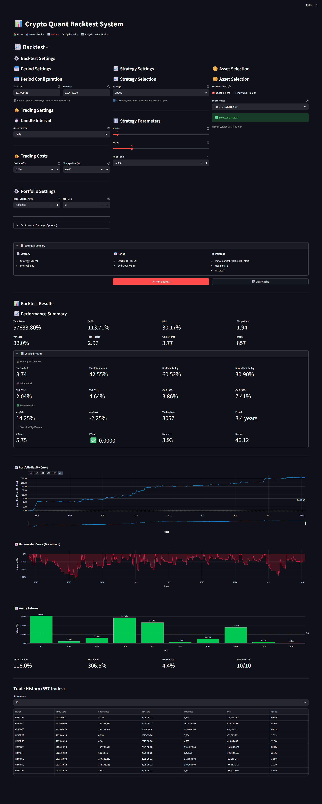

# Crypto Lab

Upbit 거래소 기반 암호화폐 퀀트 트레이딩 플랫폼.
백테스팅 엔진, 전략 개발 프레임워크, 포트폴리오 최적화, Streamlit 대시보드를 하나의 시스템으로 통합.

**[crypto-lab](https://github.com/11e3/crypto-lab)** / [crypto-bot](https://github.com/11e3/crypto-bot)

[](https://www.python.org/downloads/)
[]()
[]()
[]()
[]()

---

## Backtest Results

**VBOV1** | BTC+ETH+XRP | Daily | 2017-09-25 ~ 2026-02-10 | 초기 자본금 10,000,000 KRW

| Metric | Value | Metric | Value |
|--------|-------|--------|-------|
| Total Return | 57,633.80% | Sharpe Ratio | 1.94 |
| CAGR | 113.71% | Sortino Ratio | 3.74 |
| MDD | 30.17% | Profit Factor | 2.97 |
| Win Rate | 32.0% | Calmar Ratio | 3.77 |
| Trades | 857 | Best Year | 306.5% |
| Positive Years | 10/10 | Avg Return/Year | 116.0% |

<details>
<summary>Dashboard Screenshot</summary>



</details>

---

## Ecosystem

2개 repo가 GCS를 통해 느슨하게 결합. 코드 의존성 없이 데이터 아티팩트로만 통신.

```
┌─────────────────────────────────────────────────┐
│  crypto-bot                                     │
│                                                 │
│  Live Trading Bot (VBO V1.1)                    │
│  Upbit 실매매 · 멀티 계좌                          │
│  Docker / GCP e2-micro                          │
│                                                 │
│         trade logs ──── GCS 쓰기 ──────┐         │
└─────────────────────────────────────────┼───────┘
                                          │
                                          ▼
                                    ┌──────────┐
                                    │   GCS    │
                                    │  logs/   │
                                    └────┬─────┘
                                         │
                                         ▼
┌────────────────────────────────────────┼────────┐
│  crypto-lab (this repo)                │        │
│                                        │        │
│  Backtesting Engine ─── Strategy Framework      │
│  Streamlit Dashboard ── Bot Monitor ◄──┘        │
│  Data Pipeline ──────── Risk Management         │
│  Optimization ───────── WFA / Monte Carlo       │
└─────────────────────────────────────────────────┘
```

| Repo | 역할 | LOC | 상태 |
|------|------|-----|------|
| **crypto-lab** | 백테스트, 대시보드, 데이터 파이프라인 | ~7,500 | Active |
| **[crypto-bot](https://github.com/11e3/crypto-bot)** | Upbit 실매매 봇 (VBO) | ~720 | Active (독립 배포) |

**왜 분리하는가?** — crypto-bot은 경량 봇(pyupbit+pandas). Docker로 GCP e2-micro(무료)에 독립 배포. 흡수하면 배포 복잡도만 증가.

---

## Features

### Dual Backtesting Engine

동일한 Strategy 코드가 양쪽 엔진에서 동작:

| 엔진 | 용도 | 특징 |
|------|------|------|
| **EventDrivenBacktestEngine** | 전략 개발, 정확한 검증 | 일별 순차 처리, 상세 거래 로그 |
| **VectorizedBacktestEngine** | 파라미터 최적화 | NumPy 배치 처리, ~100x 빠름 |

```python
from src.backtester.engine import EventDrivenBacktestEngine, VectorizedBacktestEngine
from src.backtester.models import BacktestConfig
from src.strategies.volatility_breakout.vbo_v1 import VBOV1

config = BacktestConfig(initial_capital=10_000_000, fee_rate=0.0005, slippage_rate=0.001)
engine = VectorizedBacktestEngine(config)
strategy = VBOV1(name="VBOV1", ma_short=5, btc_ma=10, data_dir=DATA_DIR, interval="day")
result = engine.run(strategy, data_files)

print(f"CAGR: {result.cagr:.2f}%, MDD: {result.mdd:.2f}%, Sharpe: {result.sharpe_ratio:.2f}")
```

### Strategy Framework

조합 가능한 Condition 패턴 기반. `Strategy` 서브클래스 작성 시 대시보드에 자동 노출.

```python
from src.strategies.base import Strategy

class MyStrategy(Strategy):
    def __init__(self, name: str, my_param: int = 10, **kwargs):
        super().__init__(name, **kwargs)
        # my_param이 대시보드 UI에 슬라이더로 자동 생성됨
```

현재 등록된 전략:

| 전략 | 설명 |
|------|------|
| **VBOV1** | 고정 K=0.5, 시가 매도, BTC MA20 필터 |

### Web Dashboard

```bash
streamlit run src/web/app.py
```

| 페이지 | 기능 |
|--------|------|
| **Data Collection** | Upbit OHLCV 수집, 상태 확인 |
| **Backtest** | 전략 선택, 파라미터 설정, 30+ 메트릭, 차트 |
| **Optimization** | Grid/Random 파라미터 탐색 |
| **Analysis** | Walk-Forward, Monte Carlo, Bootstrap, CPCV |
| **Bot Monitor** | GCS 로그 기반 실시간 모니터링 |

### Data Pipeline

```bash
python scripts/fetch_data.py --symbols BTC,ETH,XRP --interval day
python scripts/fetch_data.py --update                              # 기존 데이터 증분 업데이트
python scripts/fetch_data.py --symbols BTC --interval day,minute240,minute30
```

Parquet 파일명 규칙: `{ticker}_{interval}.parquet` (flat, 하위 디렉토리 없음)

### Risk Management

| 기능 | 구현 |
|------|------|
| Position Sizing | Equal, Kelly, Fractional Kelly |
| Portfolio Optimization | MVO, HRP, Risk Parity |
| Risk Metrics | VaR, CVaR, Volatility, Drawdown |
| Advanced Orders | Stop Loss, Take Profit, Trailing Stop |

### Performance Metrics (30+)

| 카테고리 | 메트릭 |
|----------|--------|
| **수익** | Total Return, CAGR, Monthly/Yearly Returns |
| **리스크** | MDD, Volatility, VaR, CVaR, Downside Deviation |
| **위험조정** | Sharpe, Sortino, Calmar, Information Ratio |
| **거래통계** | Win Rate, Profit Factor, Avg Trade, Expectancy |
| **통계** | Skewness, Kurtosis, Hit Ratio, Max Consecutive |

---

## Quick Start

### Installation

```bash
git clone <repository-url>
cd crypto-lab

# uv (recommended)
uv sync --all-extras

# pip
pip install -e ".[dev]"
```

### Run

```bash
# Dashboard
streamlit run src/web/app.py

# Backtest (CLI)
python scripts/backtest/run_backtest.py --mode report

# Tests
python -m pytest tests/ -x -q
```

### Quality Gates

```bash
python -m ruff check src/ tests/                          # Lint
python -m ruff format src/ tests/                         # Format
python -m mypy src/ --strict                              # Type check
python -m pytest tests/ --cov=src --cov-fail-under=80     # Tests + coverage
```

---

## Project Structure

```
crypto-lab/
├── src/
│   ├── backtester/
│   │   ├── engine/
│   │   │   ├── vectorized.py           # NumPy 배치 엔진
│   │   │   ├── event_driven.py         # 일별 순차 엔진
│   │   │   ├── signal_processor.py     # 진입/퇴출 가격 (exit_price_base 지원)
│   │   │   ├── trade_simulator.py      # 벡터화 거래 시뮬레이션
│   │   │   ├── event_exec.py           # 이벤트 기반 거래 실행
│   │   │   └── trade_costs.py          # 수수료/슬리피지
│   │   ├── analysis/                   # CPCV, Bootstrap, Monte Carlo
│   │   ├── wfa/                        # Walk-Forward Analysis
│   │   ├── models.py                   # BacktestConfig, BacktestResult, Trade
│   │   ├── metrics.py                  # 30+ 성과 메트릭
│   │   └── optimization.py            # Grid/Random 파라미터 최적화
│   │
│   ├── strategies/
│   │   ├── base.py                     # Strategy ABC (Composable Conditions)
│   │   ├── common_conditions.py        # 재사용 가능한 조건 구현
│   │   └── volatility_breakout/
│   │       ├── vbo_v1.py               # VBOV1 (고정K=0.5, 시가매도, BTC MA필터)
│   │       └── btc_data_loader.py      # BTC 데이터 로더
│   │
│   ├── data/                           # Upbit OHLCV 수집, GCS 연동
│   ├── orders/                         # Stop loss, take profit, trailing stop
│   ├── risk/                           # Portfolio optimization, position sizing, VaR
│   ├── web/                            # Streamlit 대시보드
│   │   ├── app.py                      # 진입점
│   │   ├── pages/                      # backtest, optimization, analysis, monitor
│   │   ├── components/                 # 재사용 UI 컴포넌트
│   │   └── services/                   # 비즈니스 로직
│   │
│   ├── config/                         # constants.py, settings.py, YAML 로더
│   ├── monitoring/                     # 구조화 로깅, 메트릭
│   └── utils/                          # 로거, 기술적 지표, 메트릭 코어
│
├── tests/
│   ├── unit/                           # 모듈별 단위 테스트
│   └── integration/                    # 회계 정확성, 엔진 일관성 등
│
├── scripts/
│   ├── fetch_data.py                   # OHLCV 다운로더
│   └── backtest/                       # 백테스트 CLI
│
├── data/raw/                           # Parquet OHLCV 파일
├── models/                             # ML regime classifier (.joblib)
├── docs/                               # 아키텍처, 다이어그램, 가이드
└── pyproject.toml                      # 패키지 설정
```

---

## Architecture Decisions

### Dual Engine
정확성(EventDriven)과 속도(Vectorized)가 모두 필요. 동일 Strategy 코드가 양쪽에서 동작하되, 의도적으로 다른 결과를 낸다 (whipsaw 카운팅, equity curve 길이 차이).

### exit_price_base Convention
전략이 매도 기준 가격을 지정 가능. VBOV1은 시가(open)에 매도. `signal_processor`와 `event_data_loader`가 이 컬럼을 인식하여 슬리피지 적용.

### Composable Conditions
전략 = 진입 조건(AND) + 퇴출 조건(AND). `Condition` ABC를 조합해서 새로운 전략 구성.

### Strategy Auto-Registration
`Strategy` 서브클래스 작성 → `StrategyRegistry`가 `__init__` 시그니처에서 파라미터 자동 추출 → 대시보드 UI 자동 생성.

### GCS Ecosystem
코드 의존 없이 GCS 아티팩트로 통신. 각 repo가 독립적으로 배포/스케일 가능.

---

## GCS Integration

```bash
# .env
GCS_BUCKET=your-quant-bucket
GOOGLE_APPLICATION_CREDENTIALS=/path/to/service-account.json
```

```
gs://your-quant-bucket/
├── logs/{account}/
│   ├── trades_2026-02-11.csv
│   └── positions.json
├── models/
│   └── regime_classifier_xgb_ultra5.joblib
└── data/processed/
    └── BTC_day.parquet
```

---

## Development

| Metric | Value |
|--------|-------|
| Tests | 1,004 passed |
| Coverage | 87.76% |
| MyPy (strict) | 0 errors |
| Ruff | 0 errors |
| Source LOC | ~7,500 |

---

## License

MIT License

---

**v3.0.0** | Python 3.13 | Streamlit

## Changelog

### v3.0.0 (2026-02-11)
- bt 프레임워크 핵심 로직 흡수 (CPCV, BTC 필터, ML regime)
- VBOV1 전략 포팅 (고정 K=0.5, 시가 매도, exit_price_base 컨벤션)
- 전략 정리: VBOV1만 남기고 나머지 삭제 (Momentum, MeanReversion, ORB, VBO variants)
- 네이밍 통일: bt_ 접두사 → vbo_, CQS → crypto-lab
- 백테스트 회계 감사: 이벤트 엔진 PnL 수수료 버그 + finalize 슬리피지 버그 수정
- Clean Code: `except Exception` 43→11건, EventDrivenEngine 메서드 분리
- MyPy Strict 0 errors, Ruff 0, 1,004 tests, 87.76% coverage

### v2.1.0 (2026-01-22)
- Equity curve normalized display with log scale
- Simplified backtest results tabs
- GCS environment variables fix
- Parameter slider bounds fix
