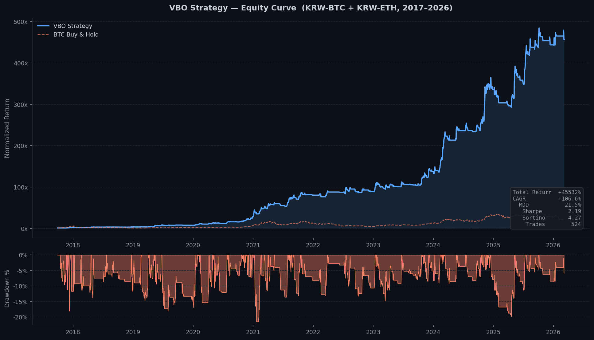
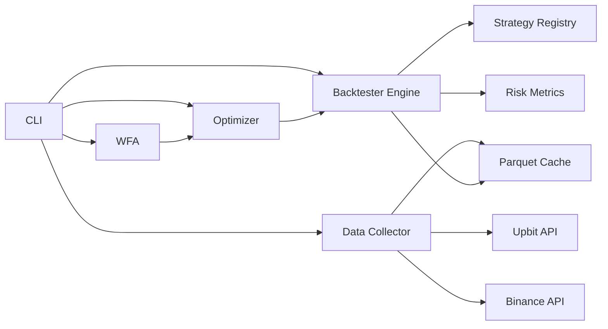

# crypto-lab

A quantitative backtesting and strategy research platform for Upbit/Binance.

> Korean version: [README_KR.md](README_KR.md)



> VBO strategy on KRW-BTC + KRW-ETH (2017–2026), initial capital ₩10,000,000, 2 slots.
> Blue: strategy equity. Red dashed: BTC buy-and-hold benchmark.

- **Vectorized backtester** — event-driven simulation with realistic cost model (fees + slippage)
- **Parameter optimization** — grid and random search with parallel execution
- **Walk-forward analysis** — out-of-sample validation to detect overfitting
- **Data collection** — incremental OHLCV ingestion from Upbit and Binance
- **Risk analysis** — VaR, CVaR, portfolio optimization (MPT, risk parity)
- **CLI** — entire workflow driven by a single `crypto-lab` command

---

## Installation

Requires Python 3.12+.

```bash
# Install with all extras
pip install -e ".[analysis,dev]"

# Or with uv
uv sync --all-extras
```

---

## Quick Start

### List registered strategies

```bash
crypto-lab list
# VBO
# VBO_DAY
```

### Run a backtest

```bash
crypto-lab backtest \
  --tickers KRW-BTC KRW-ETH \
  --strategy VBO \
  --start 2022-01-01 \
  --end 2024-12-31 \
  --capital 10000000 \
  --slots 2

=== Backtest: VBO ===
  Total Return : 318.11%
  CAGR         : 61.10%
  MDD          : -14.80%
  Sharpe       : 1.91
  Win Rate     : 32.9%
  Total Trades : 207
```

### Parameter optimization

```bash
crypto-lab optimize \
  --tickers KRW-BTC KRW-ETH \
  --strategy VBO \
  --metric sharpe_ratio \
  --method grid \
  --workers 4

# === Optimize: VBO ===
#   Best Score (sharpe_ratio): 2.5400
#   Best Params:
#     noise_ratio: 0.6
#     btc_ma: 30
#     ma_short: 3
```

### Walk-forward analysis

```bash
crypto-lab wfa \
  --tickers KRW-BTC KRW-ETH \
  --strategy VBO \
  --opt-days 365 \
  --test-days 90 \
  --step-days 90 \
  --metric sharpe_ratio

# === Walk-Forward Analysis ===
#   Periods       : 8
#   Positive      : 7/8
#   Consistency   : 87.5%
#   Avg CAGR      : 38.50%
#   Avg Sharpe    : 2.21
#   Avg MDD       : -19.2%
```

### Data collection

```bash
crypto-lab collect \
  --tickers KRW-BTC KRW-ETH KRW-XRP \
  --interval day \
  --source upbit
```

---

## CLI Reference

```
crypto-lab [--log-level LEVEL] COMMAND

Commands:
  backtest   Run a strategy backtest on historical data
  optimize   Grid/random parameter search
  collect    Fetch OHLCV data from an exchange
  wfa        Walk-forward analysis
  list       Print registered strategies
```

Common flags for `backtest`, `optimize`, and `wfa`:

| Flag | Default | Description |
|------|---------|-------------|
| `--tickers` | (required) | Space-separated Upbit tickers, e.g. `KRW-BTC KRW-ETH` |
| `--strategy` | (required) | Registered strategy name |
| `--start` | full history | Start date `YYYY-MM-DD` |
| `--end` | full history | End date `YYYY-MM-DD` |
| `--capital` | 1,000,000 | Initial capital (KRW) |
| `--slots` | 5 | Maximum concurrent positions |
| `--fee` | 0.0005 | Per-trade fee rate (0.05%) |
| `--interval` | `day` | Candle interval (`day`, `minute240`, …) |

---

## Architecture


```mermaid
graph LR
    A[CLI] --> B[Backtester Engine]
    A --> C[Optimizer]
    A --> D[WFA]
    A --> E[Data Collector]
    B --> F[Strategy Registry]
    B --> G[Risk Metrics]
    C --> B
    D --> C
    E --> H[Upbit API]
    E --> I[Binance API]
    E --> J[Parquet Cache]
    B --> J
```

---

## Project Structure

```
src/
├── main.py                  # CLI entry point
├── cli/                     # CLI subcommand modules
│   ├── cmd_backtest.py      #   backtest, optimize
│   ├── cmd_data.py          #   collect
│   └── cmd_wfa.py           #   wfa
├── strategies/
│   ├── base.py              # Strategy abstract base class
│   ├── registry.py          # StrategyFactory singleton
│   └── volatility_breakout/
│       ├── vbo_v1.py        # VBOV1 — breakout + BTC MA filter + MA exit
│       └── vbo_day_exit.py  # VBODayExit — fixed 1-day hold
├── backtester/
│   ├── engine/              # Vectorized + event-driven engine, run_backtest()
│   ├── optimization.py      # Grid/random parameter optimizer
│   ├── wfa/                 # Walk-forward analysis
│   ├── analysis/            # Permutation test, robustness, bootstrap
│   └── models.py            # BacktestConfig, BacktestResult, Trade
├── data/
│   ├── collector.py         # UpbitDataCollector (incremental parquet updates)
│   ├── collector_factory.py # DataCollectorFactory
│   ├── upbit_source.py      # Upbit OHLCV data source
│   ├── binance_source.py    # Binance OHLCV data source
│   └── cache/               # LRU data cache
├── risk/
│   ├── position_sizing.py   # Equal, volatility-adjusted, Kelly sizing
│   ├── portfolio_methods.py # MPT + risk parity optimization
│   └── metrics*.py          # VaR, CVaR, Sharpe, Sortino, …
├── config/                  # Pydantic settings + YAML loader
└── utils/
    ├── indicators.py         # SMA, EMA, ATR, RSI, Bollinger Bands
    └── indicators_vbo.py     # VBO-specific: target price, noise range
```

---

## Writing a Strategy

Subclass `Strategy` and register it with `@registry.register`:

```python
from src.strategies.base import Strategy
from src.strategies.registry import registry
import pandas as pd


@registry.register("MyStrategy")
class MyStrategy(Strategy):
    def __init__(self, period: int = 20) -> None:
        super().__init__(name="MyStrategy")
        self.period = period

    def generate_signals(self, df: pd.DataFrame) -> pd.DataFrame:
        df["sma"] = df["close"].rolling(self.period).mean()
        df["entry_signal"] = df["close"] > df["sma"]
        df["exit_signal"] = df["close"] < df["sma"]
        return df

    @classmethod
    def parameter_schema(cls) -> dict[str, object]:
        return {
            "period": {"type": "int", "min": 5, "max": 60, "step": 5},
        }
```

`parameter_schema()` drives both `optimize` and `wfa` — no additional wiring needed.

---

## SQL Analysis (DuckDB)

Query parquet files directly with SQL — no import step required.

```bash
pip install -e ".[analysis]"
jupyter notebook notebooks/duckdb_analysis.ipynb
```

Topics covered in [`notebooks/duckdb_analysis.ipynb`](notebooks/duckdb_analysis.ipynb):

| Section | SQL concepts |
|---------|--------------|
| Basic queries | `SELECT`, `WHERE`, `ORDER BY` |
| Monthly aggregation | `GROUP BY`, `AVG`, `MAX`, `MIN` |
| Window functions | `LAG()`, `AVG() OVER`, moving averages |
| CTEs | Re-implementing VBO signals with `WITH` clauses |
| Multi-ticker | `JOIN`, `CORR`, `STDDEV` |

---

## Volatility Breakout Strategy (VBO)

Entry conditions (both must be met):

1. **Breakout**: `high >= open + prev_range * noise_ratio`
2. **BTC filter**: `prev BTC close > prev BTC MA(btc_ma)`

Exit condition (VBOV1): previous `close < SMA(ma_short)` — exit at next open.

Exit condition (VBODayExit): always exit at the next day's open.

### Optimal Parameters (BTC+ETH, 2020–2024)

| Objective | noise_ratio | btc_ma | ma_short | Sharpe | CAGR | MDD |
|-----------|-------------|--------|----------|--------|------|-----|
| Balanced | 0.6 | 30 | 3 | 2.54 | +121% | −17.9% |
| Max return | 0.3 | 10 | 3 | 2.20 | +128% | −23.9% |
| Min drawdown | 0.8 | 30 | 3 | 2.05 | +101% | −16.7% |

Full sweep research: [`src/research/results/vb_upbit/README.md`](src/research/results/vb_upbit/README.md)

---

## Development

```bash
# Run tests
pytest tests/ -x -q

# Lint + format
ruff check src/ && ruff format src/

# Type checking
mypy src/ --strict

# All three (quality gate)
pytest tests/ -x -q && ruff check src/ && mypy src/ --strict
```

Coverage threshold is **80%** (currently ~84%).

### Code Conventions

- Files ≤ 200 lines, functions ≤ 50 lines
- Type annotations required on all public functions (mypy strict)
- Comments in English only
- Heavy dependencies (pyupbit, ccxt, matplotlib) are lazy-imported inside functions

---

## Data Layout

```
data/
├── upbit/          # Parquet files: KRW-BTC_day.parquet, KRW-ETH_minute240.parquet, …
└── binance/        # Parquet files: BTC_USDT_1d.parquet, …
```

Files are created/updated automatically when running `crypto-lab collect`.

---

## License

MIT
